## Лабораторная работа 1

## так я делаю лабы:


### Задание 1
```python
name = input("Имя: ")
age = int(input("Возраст: "))
print(f"Привет, {name}! Через год тебе будет {age + 1}.")
```
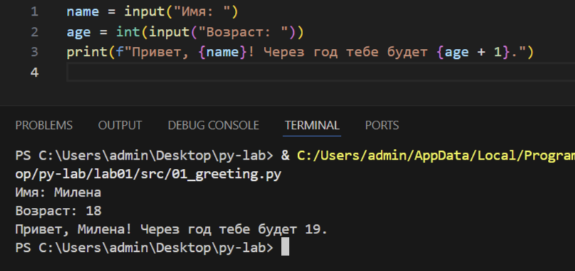

### Задание 2
```python
a = float(input("A: ").replace(",", "."))
b = float(input("B: ").replace(",", "."))

print(f"sum={a + b}; avg={(a + b) / 2}")
```
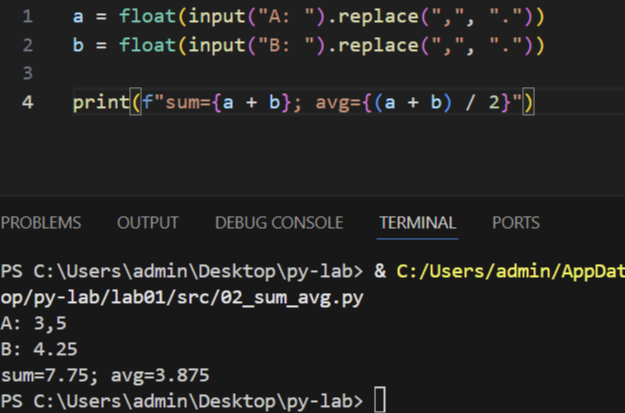

### Задание 3
```python
price=float(input("Цена: "))
discount=float(input("Скидка: "))
vat=float(input("НДС: "))

base=price*(1-discount/100)
vat_amount=base*(vat/100)
total=base+vat_amount
print(f"Бфза после скидки: {base:.2f}")
print(f"НДС: {vat_amount:.2f}")
print(f"Итого к оплате: {total:.2f}")
```
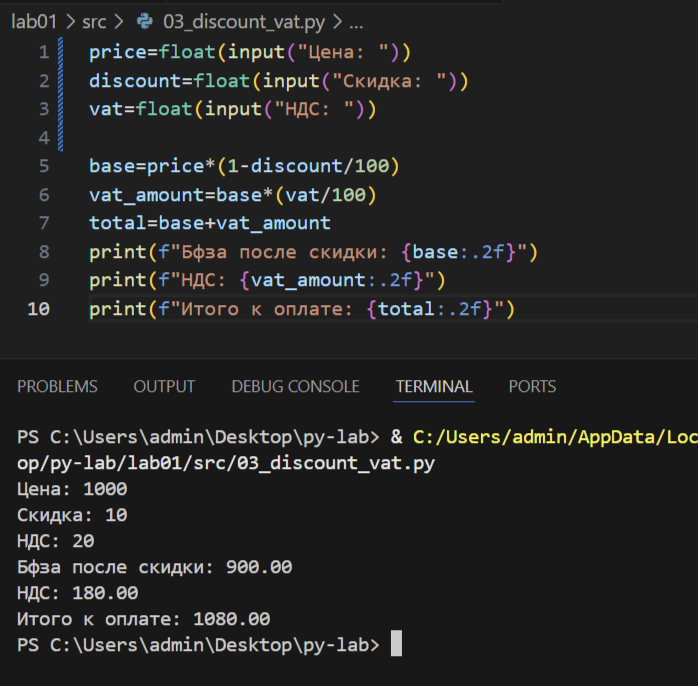
### Задание 4
```python
m=int(input("Минуты:"))
print(f"{m//60:02d}:{m%60:02d}")
```
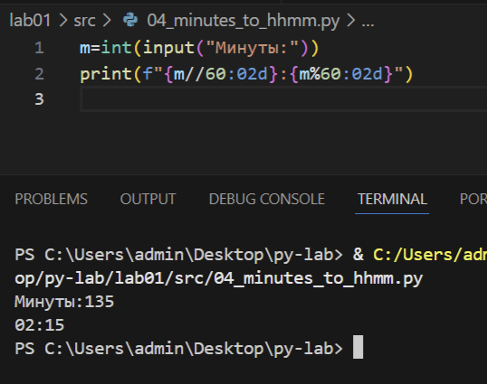
### Задание 5
```python
name=input("ФИО:").strip()
n=name.split()
print(f"Инициалы: {n[0][0]}{n[1][0]}{n[2][0]}.")
n2=' '.join(n)
print(f"Длина: {len(n2)}")
```
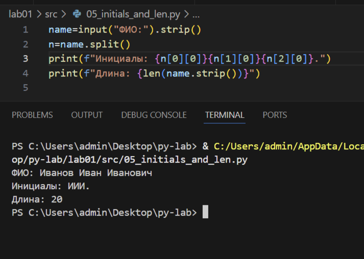

### Задание 6
```python
n=int(input("Количество студентов: "))
och=zoch=0
for i in range(n):
    inf=input("Фамилия, Имя, возраст, форма обучения: ").split()
    if inf[3]=="True":
        och+=1
    else:
        zoch+=1
print(och,zoch)
```
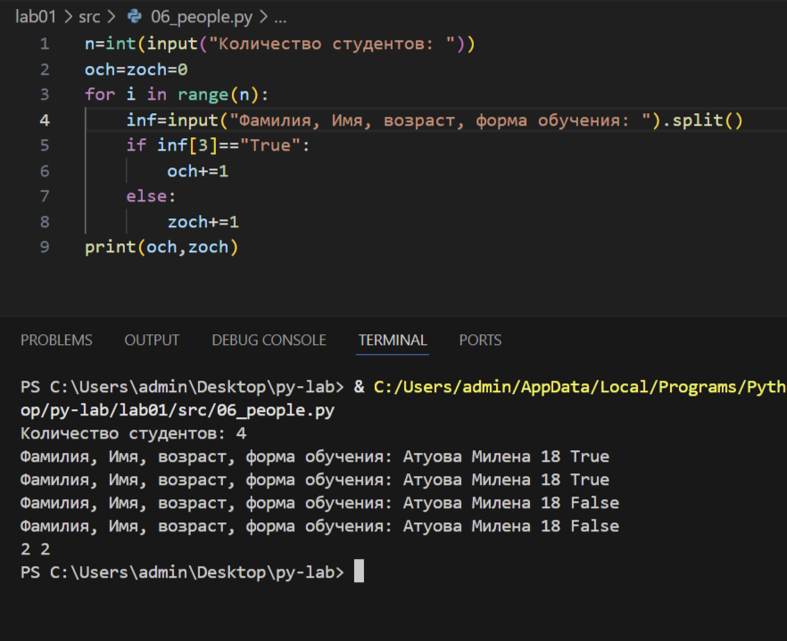

## Лабораторная работа 2

### Задание 1.1
```python
def min_max(nums: list[float | int]) -> tuple[float | int, float | int]:
    if len(nums) == 0:
        return ValueError

    mn = 10**100
    mx = 10**100

    for i in range(len(nums)):
        if nums[i] < mn:
            mn = nums[i]
        if nums[i] > mx:
            mx = nums[i]

    return tuple([mn, mx])

```
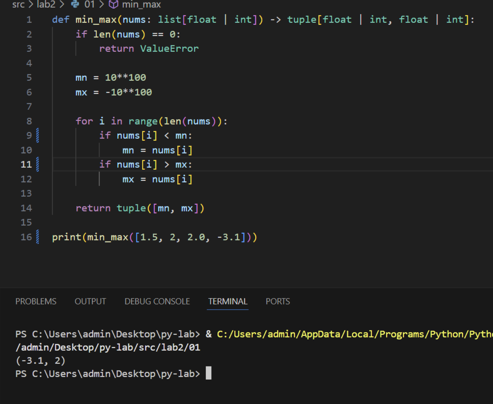
### Задание 1.2
```python
def unique_sorted(nums: list[float | int]) -> list[float | int]:
    return sorted(set(nums))

```
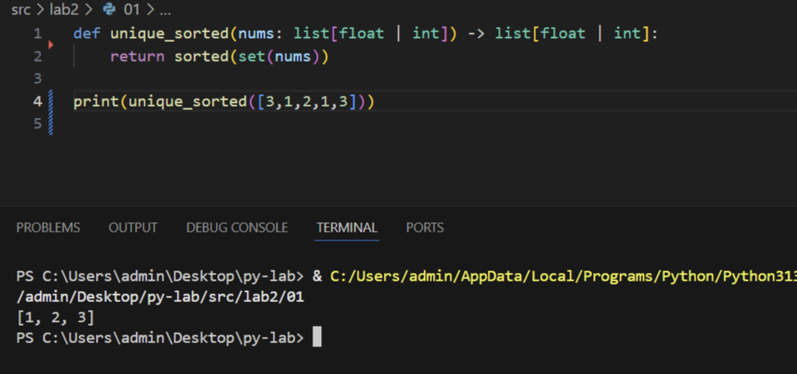

### Задание 1.3
```python
def flatten(mat: list[list | tuple]) -> list:
    array = list()
    for arr in mat:
        if not (isinstance(arr, tuple) or isinstance(arr, list)):
            return TypeError
        for member in arr:
            array.append(member)
    return array
```
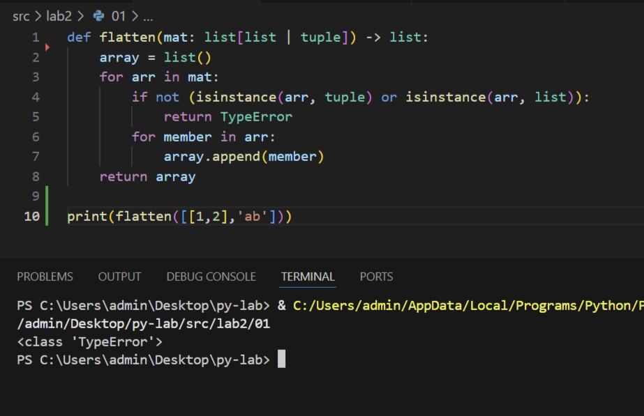

### Задание 2.1
```python
def check_is_valid(mat: list[list[float | int]]) -> bool:
    if any(len(mat[0]) != len(mat[i]) for i in range(len(mat))):
        return False
    return True


def transpose(mat: list[list[float | int]]) -> list[list]:
    if len(mat) == 0:
        return []

    if not check_is_valid(mat=mat):
        return ValueError

    new_matrix = [[0 for j in range(len(mat))] for i in range(len(mat[0]))]

    for i in range(len(mat)):
        for j in range(len(mat[i])):
            new_matrix[j][i] = mat[i][j]

    return new_matrix

```
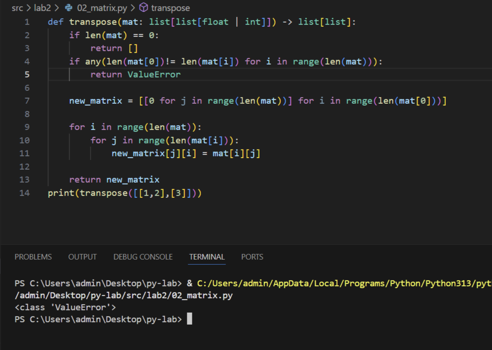

### Задание 2.2
```python

def check_is_valid(mat: list[list[float | int]]) -> bool:
    if any(len(mat[0]) != len(mat[i]) for i in range(len(mat))):
        return False
    return True

def row_sums(mat: list[list[float | int]]) -> list[float]:
    if not check_is_valid(mat=mat):
        return ValueError

    array = list()
    for arr in mat:
        array.append(sum(arr))
    return array
```
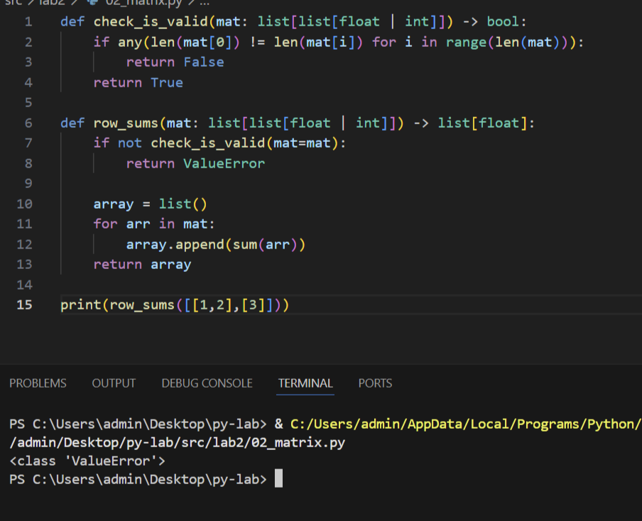

### Задание 2.3
```python

def check_is_valid(mat: list[list[float | int]]) -> bool:
    if any(len(mat[0]) != len(mat[i]) for i in range(len(mat))):
        return False
    return True

def col_sums(mat: list[list[float | int]]) -> list[float]:
    if not check_is_valid(mat=mat):
        return ValueError

    array = list(0 for i in range(len(mat[0])))
    for i in range(len(mat)):
        for j in range(len(mat[i])):
            array[j] += mat[i][j]
    return array
```
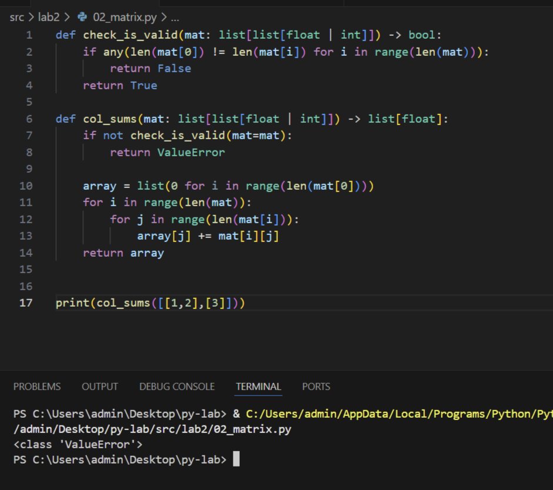

### Задание 3
```python

def format_record(rec: tuple[str, str, float]) -> str:

    name_data = rec[0].strip().split()

    if len(name_data) > 2:
        surname, name, patronymic = rec[0].strip().split()
        name_string_data = f"{surname[0].upper()}{surname[1:]} {name[0].upper()}.{patronymic[0].upper()}."
    elif len(name_data) == 2:
        surname, name = rec[0].strip().split()
        name_string_data = f"{surname[0].upper()}{surname[1:]} {name[0].upper()}."
    elif len(name_data) == 1:
        surname = rec[0].strip().split()
        name_string_data = f"{surname[0].upper()}{surname[1:]}"
    else:
        return ValueError

    group = rec[1].strip()
    if group == "":
        return ValueError

    try:
        gpa = float(rec[2])
    except Exception as _:
        return TypeError

    return f"{name_string_data}, гр. {group}, GPA {gpa:.2f}"
print(format_record(("  сидорова  анна   сергеевна ", "ABB-01", 3.999)))
```
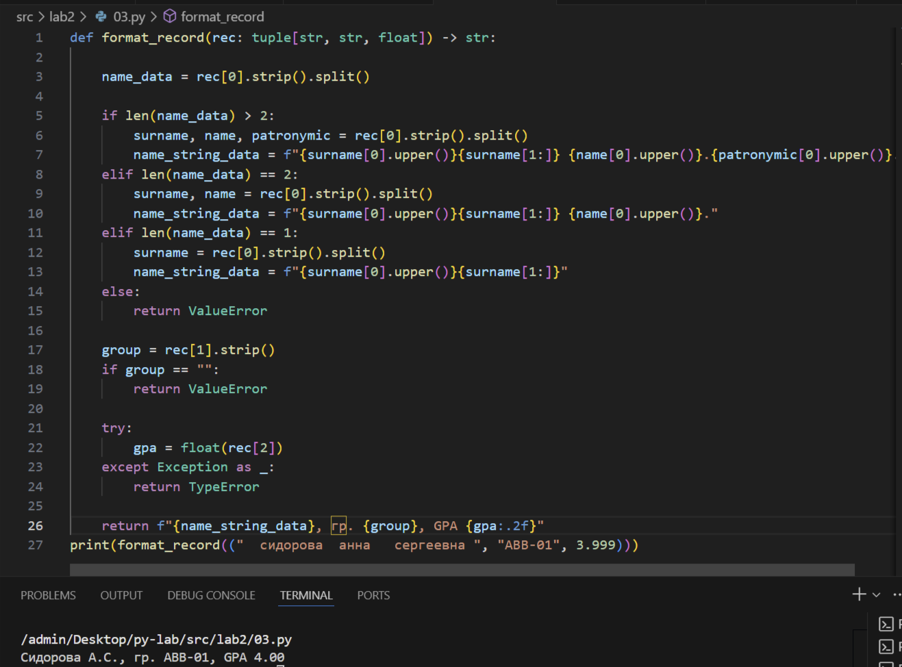
