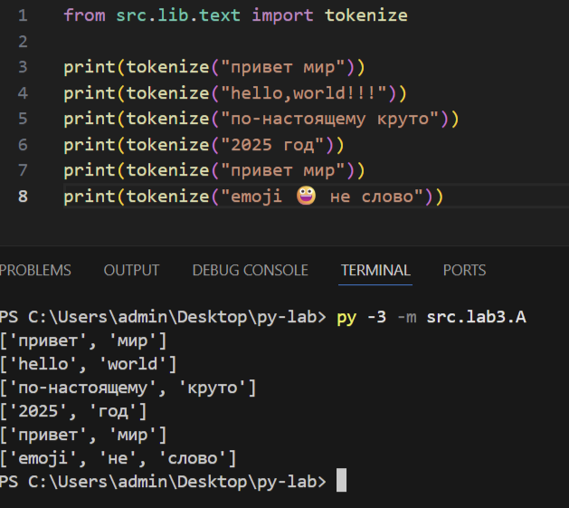

## Лабораторная работа 1


### Задание 1
```python
name = input("Имя: ")
age = int(input("Возраст: "))
print(f"Привет, {name}! Через год тебе будет {age + 1}.")
```


### Задание 2
```python
a = float(input("A: ").replace(",", "."))
b = float(input("B: ").replace(",", "."))

print(f"sum={a + b}; avg={(a + b) / 2}")
```


### Задание 3
```python
price=float(input("Цена: "))
discount=float(input("Скидка: "))
vat=float(input("НДС: "))

base=price*(1-discount/100)
vat_amount=base*(vat/100)
total=base+vat_amount
print(f"Бфза после скидки: {base:.2f}")
print(f"НДС: {vat_amount:.2f}")
print(f"Итого к оплате: {total:.2f}")
```

### Задание 4
```python
m=int(input("Минуты:"))
print(f"{m//60:02d}:{m%60:02d}")
```

### Задание 5
```python
name=input("ФИО:").strip()
n=name.split()
print(f"Инициалы: {n[0][0]}{n[1][0]}{n[2][0]}.")
n2=' '.join(n)
print(f"Длина: {len(n2)}")
```


### Задание 6
```python
n=int(input("Количество студентов: "))
och=zoch=0
for i in range(n):
    inf=input("Фамилия, Имя, возраст, форма обучения: ").split()
    if inf[3]=="True":
        och+=1
    else:
        zoch+=1
print(och,zoch)
```


## Лабораторная работа 2


### Задание 1.1
```python
def min_max(nums: list[float | int]) -> tuple[float | int, float | int]:
    if len(nums) == 0:
        return ValueError

    mn = 10**100
    mx = 10**100

    for i in range(len(nums)):
        if nums[i] < mn:
            mn = nums[i]
        if nums[i] > mx:
            mx = nums[i]

    return tuple([mn, mx])

```

### Задание 1.2
```python
def unique_sorted(nums: list[float | int]) -> list[float | int]:
    return sorted(set(nums))

```


### Задание 1.3
```python
def flatten(mat: list[list | tuple]) -> list:
    array = list()
    for arr in mat:
        if not (isinstance(arr, tuple) or isinstance(arr, list)):
            return TypeError
        for member in arr:
            array.append(member)
    return array
```


### Задание 2.1
```python
def check_is_valid(mat: list[list[float | int]]) -> bool:
    if any(len(mat[0]) != len(mat[i]) for i in range(len(mat))):
        return False
    return True


def transpose(mat: list[list[float | int]]) -> list[list]:
    if len(mat) == 0:
        return []

    if not check_is_valid(mat=mat):
        return ValueError

    new_matrix = [[0 for j in range(len(mat))] for i in range(len(mat[0]))]

    for i in range(len(mat)):
        for j in range(len(mat[i])):
            new_matrix[j][i] = mat[i][j]

    return new_matrix

```


### Задание 2.2
```python

def check_is_valid(mat: list[list[float | int]]) -> bool:
    if any(len(mat[0]) != len(mat[i]) for i in range(len(mat))):
        return False
    return True

def row_sums(mat: list[list[float | int]]) -> list[float]:
    if not check_is_valid(mat=mat):
        return ValueError

    array = list()
    for arr in mat:
        array.append(sum(arr))
    return array
```


### Задание 2.3
```python

def check_is_valid(mat: list[list[float | int]]) -> bool:
    if any(len(mat[0]) != len(mat[i]) for i in range(len(mat))):
        return False
    return True

def col_sums(mat: list[list[float | int]]) -> list[float]:
    if not check_is_valid(mat=mat):
        return ValueError

    array = list(0 for i in range(len(mat[0])))
    for i in range(len(mat)):
        for j in range(len(mat[i])):
            array[j] += mat[i][j]
    return array
```


### Задание 3
```python

def format_record(rec: tuple[str, str, float]) -> str:

    name_data = rec[0].strip().split()

    if len(name_data) > 2:
        surname, name, patronymic = rec[0].strip().split()
        name_string_data = f"{surname[0].upper()}{surname[1:]} {name[0].upper()}.{patronymic[0].upper()}."
    elif len(name_data) == 2:
        surname, name = rec[0].strip().split()
        name_string_data = f"{surname[0].upper()}{surname[1:]} {name[0].upper()}."
    elif len(name_data) == 1:
        surname = rec[0].strip().split()
        name_string_data = f"{surname[0].upper()}{surname[1:]}"
    else:
        return ValueError

    group = rec[1].strip()
    if group == "":
        return ValueError

    try:
        gpa = float(rec[2])
    except Exception as _:
        return TypeError

    return f"{name_string_data}, гр. {group}, GPA {gpa:.2f}"
print(format_record(("  сидорова  анна   сергеевна ", "ABB-01", 3.999)))
```


## Лабораторная работа 3


### Задание A
```python
def normalize(text: str, *, casefold: bool = True, yo2e: bool = True) -> str:
    if casefold:
        text = text.casefold()
    if yo2e:
        text = text.replace("ё", "е").replace("Ё", "Е")

    text = text.replace("\t", " ").replace("\r", " ").replace("\n", " ")

    while "  " in text:
        text = text.replace("  ", " ")

    return text.strip()
```

 ```python
import re

def tokenize(text: str) -> list[str]:
    pattern = r'\b\w+(?:-\w+)*\b'
    return re.findall(pattern, text)

```


```python
def count_freq(tokens: list[str]) -> dict[str, int]:
    counts = {}

    for i in tokens:
        if i in counts:
            counts[i] += 1
        else:
            counts[i] = 1

    return counts


def top_n(freq: dict[str, int], n: int = 5) -> list[tuple[str, int]]:
    freq = sorted(freq.items(), key=lambda item: [-item[1], item[0]])
    return freq[:n]

```


### Задание B
```python
import sys, os
sys.path.append(os.path.join(os.path.dirname(__file__), '..'))

from lib.text import normalize, tokenize, count_freq, top_n

text = sys.stdin.readline()

normalized_text = normalize(text)

tokens = tokenize(normalized_text)

total_words = len(tokens)
freq_dict = count_freq(tokens)
unique_words = len(freq_dict)
top_words = top_n(freq_dict, 5)

print(f"Всего слов: {total_words}")
print(f"Уникальных слов: {unique_words}")
print("Топ-5:")

for word, count in top_words:
    print(f"{word}:{count}")


# Таблица
USE_TABLE = True 

if USE_TABLE and top_words:
    # Вычисляем ширину первого столбца по длине самого длинного слова
    max_word_len = max(len(word) for word, i in top_words)
    header_word = "слово"
    header_freq = "частота"

    # Выровненные заголовки
    print(f"{header_word:<{max_word_len}} | {header_freq}")
    print("-" * (max_word_len + 3 + len(header_freq)))

    # Выровненные строки
    for word, count in top_words:
        print(f"{word:<{max_word_len}} | {count}")
else:
    for word, count in top_words:
        print(f"{word}:{count}")

```


## Лабораторная работа 4


### Задание A
```python
import sys
import os

# Добавляем корневую директорию в путь
ROOT_DIR = os.path.abspath(os.path.join(os.path.dirname(__file__), '..', '..'))
sys.path.insert(0, ROOT_DIR)

sys.path.append(os.path.join(os.path.dirname(__file__), '..'))


from lib.text import normalize, tokenize, count_freq, top_n

from pathlib import Path
import csv
from typing import Iterable, Sequence
from collections import Counter


def read_text(path: str | Path, encoding: str = "utf-8") -> str:
    p = Path(path)
    return p.read_text(encoding=encoding)


def write_csv(rows: Iterable[Sequence], path: str | Path,
              header: tuple[str, ...] | None = None) -> None:
    p = Path(path)
    rows = list(rows)
    with p.open("w", newline="", encoding="utf-8") as f:
        w = csv.writer(f)
        if header is not None:
            w.writerow(header)
        for r in rows:
            w.writerow(r)


def frequencies_from_text(text: str) -> dict[str, int]:
    tokens = tokenize(normalize(text))
    return Counter(tokens)  # Используем функцию из вашей библиотеки


def sorted_word_counts(freq: dict[str, int]) -> list[tuple[str, int]]:
    return sorted(freq.items(), key=lambda kv: (-kv[1], kv[0]))


txt = read_text("data/input.txt")  # должен вернуть строку
data=[i for i in top_n(count_freq(tokenize(normalize(txt))),n=5)]
write_csv(
    header=("word","count"),
    rows=data,
    path = "data/check.csv" ,
)


```


### Задание B
```python
aimport sys
import os
from pathlib import Path

# Добавляем корневую директорию в путь для импорта lib
ROOT_DIR = os.path.abspath(os.path.join(os.path.dirname(__file__), '..', '..'))
sys.path.insert(0, ROOT_DIR)

sys.path.append(os.path.join(os.path.dirname(__file__), '..'))

from lib.text import normalize, tokenize, count_freq, top_n

from lab4.io_txt_csv import read_text, write_csv

PROJECT_ROOT = Path(__file__).parent.parent.parent


input_path = PROJECT_ROOT / "data" / "input.txt"
output_path = PROJECT_ROOT / "data" / "report.csv"
p = read_text(input_path)
norm_p=normalize(p)
tokens=tokenize(norm_p)
count_word=count_freq(tokens)
top=top_n(count_freq(tokenize(normalize(p))))

write_csv(top, output_path, ["word", "count"])

print("Всего слов:", len(tokens))
print("Уникальных слов:", len(count_word))
print("Топ-5:")
for x,y in top[:5]:
    print(f'{x}:{y}')
```


## Лабораторная работа 5


### Задание A
```python
import json
import csv
from pathlib import Path

def json_to_csv(json_path: str, csv_path: str) -> None:
    jp = Path(json_path)
    if jp.suffix != ".json":
        raise ValueError("Неверный тип файла")
    if not jp.exists():
        raise FileNotFoundError("Файл не найден")
    
    with open(json_path, "r", encoding="utf-8") as f:
        data = json.load(f)
    
    if len(data) == 0:
        raise ValueError("Пустой JSON")
    

    all_headers = set()
    for item in data:
        if not isinstance(item, dict):
            raise ValueError("Элементы JSON должны быть словарями")
        all_headers.update(item.keys())  # добавляем все ключи объекта
    
    headers = sorted(all_headers)  # сортируем для порядка
    
    with open(csv_path, "w", newline="", encoding="utf-8") as f:
        writer = csv.DictWriter(f, fieldnames=headers)
        writer.writeheader()
        
        # Заполняем отсутствующие поля для каждого объекта
        for item in data:
            # Создаем строку с заголовками, заполняя отсутствующие пустыми строками
            row = {}
            for header in headers:
                row[header] = item.get(header, '')  # если ключа нет - пустая строка
            writer.writerow(row)

def csv_to_json(csv_path: str, json_path: str) -> None:
    cp = Path(csv_path)
    if cp.suffix != ".csv":
        raise ValueError("Неверный тип файла")
    if not cp.exists():
        raise FileNotFoundError("Файл не найден")
    
    with open(csv_path, "r", encoding="utf-8") as f:
        reader = csv.DictReader(f)
        rows = list(reader)
    
    if len(rows) == 0:
        raise ValueError("Пустой CSV")
    
    with open(json_path, "w", encoding="utf-8") as f:
        json.dump(rows, f, ensure_ascii=False, indent=2)


json_to_csv("data/samples/people.json", "data/out/people_from_json.csv")
csv_to_json("data/samples/people.csv", "data/out/people_from_csv.json")

```


### Задание B
```python
import csv
from pathlib import Path
from openpyxl import Workbook
from openpyxl.utils import get_column_letter

def csv_to_xlsx(csv_path: str, xlsx_path: str) -> None:
    csv_file=Path(csv_path)
    if not csv_file.exists():
        raise FileNotFoundError("Файл не найден")
    if csv_file.suffix != '.csv':
        raise ValueError("Неверный тип файла")


    wb=Workbook()
    ws=wb.active
    ws.title="Sheet1"

    with open(csv_path, 'r', encoding='utf-8') as f:
        reader= csv.DictReader(f)
        rows = list(reader)
    if len(rows)==0:
        raise ValueError("Файл не содержит данных")
    if not reader.fieldnames:
        raise ValueError("Файл не содержит заголовка")

    ws.append(reader.fieldnames)

    r_count=0
    for row in rows:
        r_count+=1

        data_for_ex=[]
        for title in reader.fieldnames:
            data_for_ex.append(row[title])
        ws.append(data_for_ex)
    if r_count == 0:
        raise ValueError("Нет данных")


    for col_index in range(1,len(reader.fieldnames)+1):
        column_letter=get_column_letter(col_index)
        max_len=0


        for row in ws[column_letter]:
            if row.value is not None:
                max_len=max(max_len,len(str(row.value)))

        m_width=max(max_len+2, 8)
        ws.column_dimensions[column_letter].width =m_width


    xlsx_path = Path(xlsx_path)
    wb.save(xlsx_path)


csv_to_xlsx("data/samples/people.csv", "data/out/people.xlsx")
csv_to_xlsx("data/samples/cities.csv", "data/out/cities.xlsx")

```


